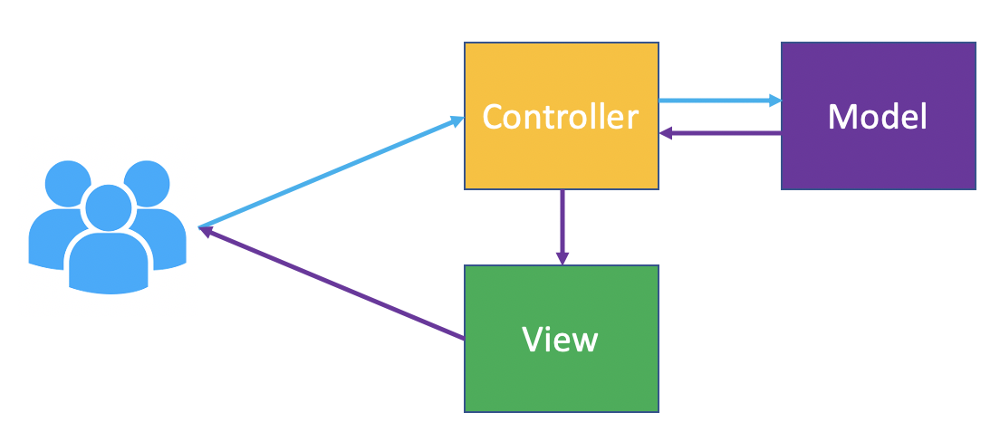

# MVC application running on Tanzu Application Service (Former Pivotal Cloud Foundry)
 
This simple demo aims to show the power of Tanzu Application Service (TAS) platfom when it comes to scale out easily application instances (AIs) and attach backing services thereon.
 
 
 
 
This simple application detetcs when it is running on Tanzu Application Service (TAS) and configure its home page accordingly. 
Different application instances (AIs) will render the UI using different background colors when running on TAS, up to 4 different colors. 
 
You can generate 10 readers at a time clicking on the button <i>Load Readers</i>. 
You can generate 100 books at a time clicking on the button <i>Load Books</i>. The first 40 books will evenly assigned to some readers. 
You can visualise the list of readers and books following the corresponding links. Use the Browser's back buttom to return. 

<h2>Testing locally:</h2>
 
<code>java -jar build/libs/library-mvc-1.0.0.jar</code> 

URL: 
--- 
localhost:8080

<h2>Testing on the Cloud:</h2>
 
1. Publish the application on TAS using the <code>cf push</code>command. 
 
Look for the route created on the output generated by the <code>cf push</code> previous command, e.g. 
<i>
 Waiting for app to start...
 
 name:              tanzu-lib
 requested state:   started
 <b>routes:            tanzu-lib-brash-shark-sb.cfapps.io</b>
</i>
 
 
2. Use the published route to access the application running on TAS. You will notice that the main page looks different now. The application has detected it is running on TAS :)  
URL: 
--- 
<code>http://&ltrandom-name&gt.cfapps.io</code> 
 
 
3. Scale out the application via the <code>cf scale app tanzu-lib -i 2</code>command. 
 
You will notice that data generated in one application instance (AI) is NOT available to others. This is due the data being stored in each AI's memory. 
We can easily fix this if our TAS installation has been configured with a SQL database Service Broker. 
Assuming we have got <i>cleardb</i> service available, we shall bind a service instance (SI) to our application. 
 
4. Create a service instance through the <code>cf create-service cleardb spark library-db</code> command. 
 
5. Declare to the platform that the application now requires the newly created <b>library-db</b> service instance adding its name on the <i>services</i> section at the end of the <i>manifest.yml</i> file. The file should look like as below after being edited: 
<pre>
---
applications:
- name: tanzu-lib
  path: build/libs/library-mvc-1.0.0.jar
  random-route: true
  env:
    JBP_CONFIG_OPEN_JDK_JRE: '{ jre: { version: 11.+ } }'
  buildpacks:
  - https://github.com/cloudfoundry/java-buildpack.git
  services:
  - library-db
</pre> 
 
6. Redeploy the application using <code>cf push</code>. 
 
7. Go back to the application and generate more data. You can follow some of the links to the lists and refresh the Browser multiple times. You will notice the same data shows up across all AIs (different background colors).

<h2>Cleaning up:</h2>
 
8. <code>cf delete tanzu-lib -r</code> 
9. <code>cf delete-service library-db</code> 

<h2>Architectural Decisions:</h2>
 
1) The application implements the Model-View-Controller (MVC) architectural pattern which the Spring framework makes it really easy. 
 
2) A SQL database has been chosen as data store. The default implementation is the H2 embedded in-memory database. 

